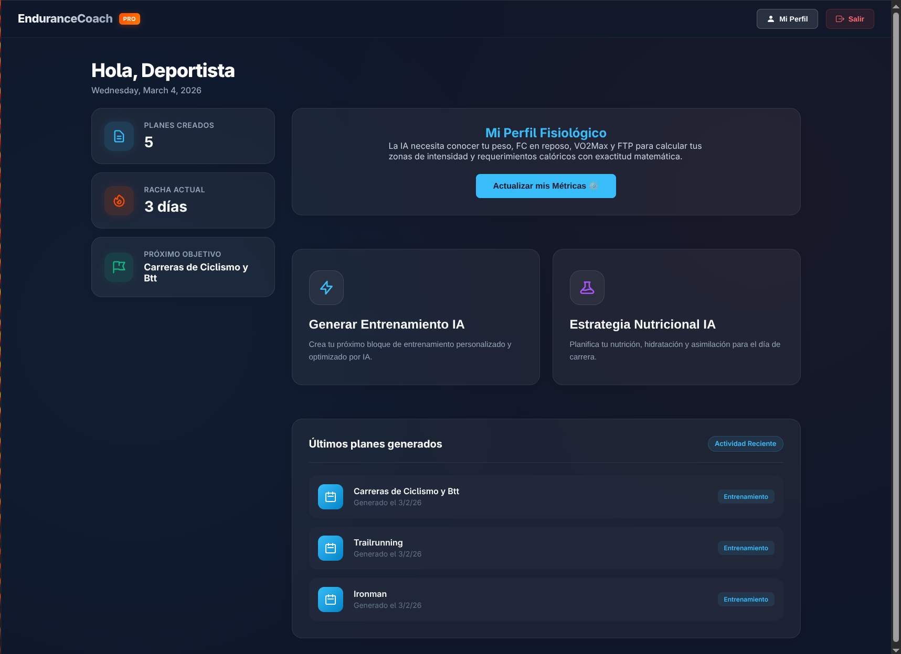
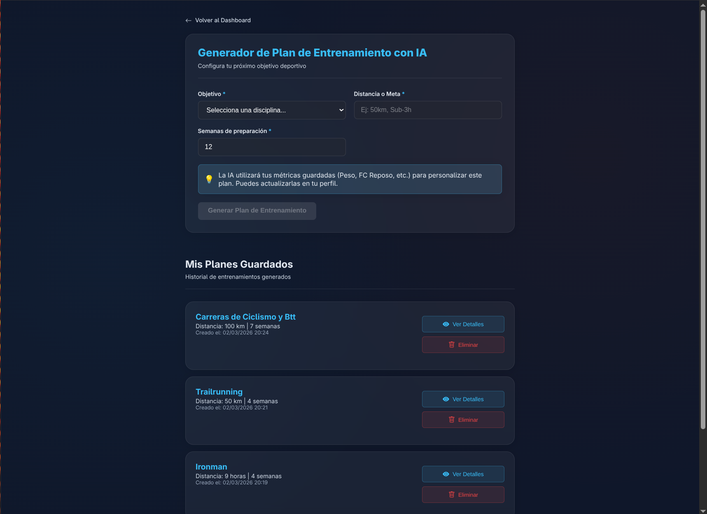
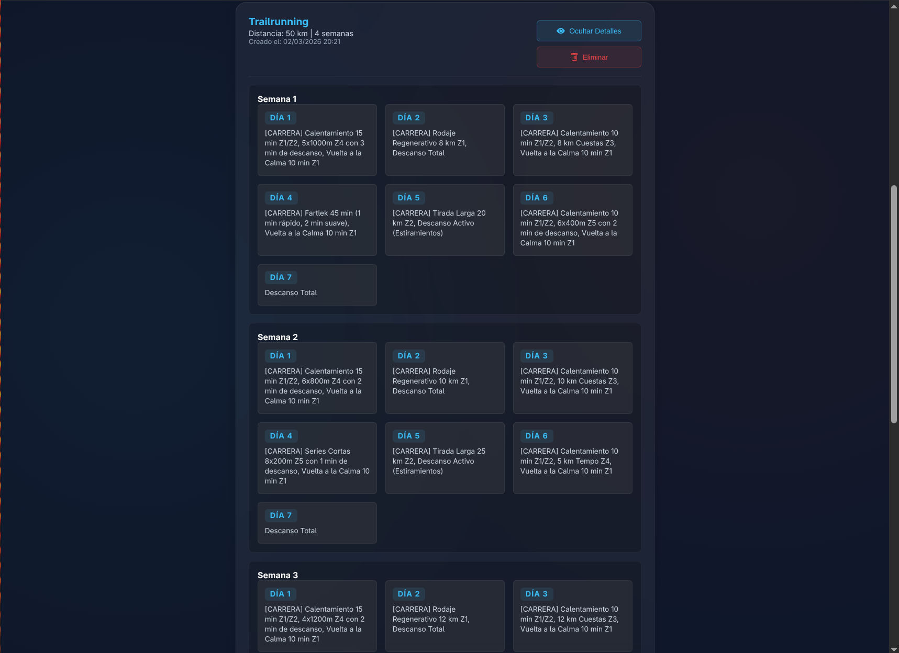
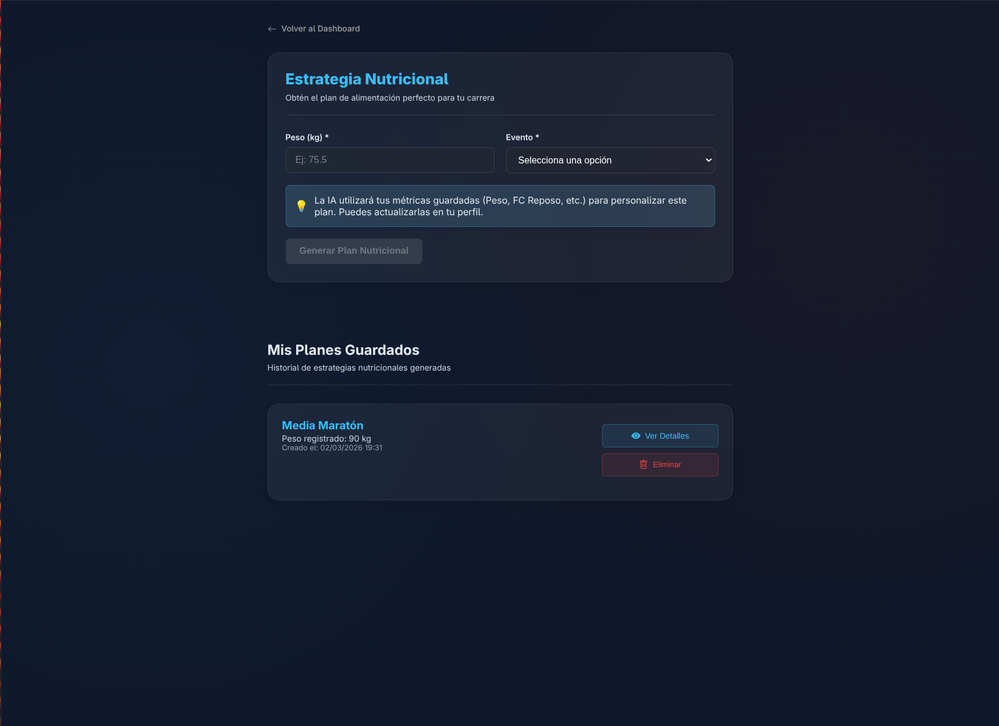
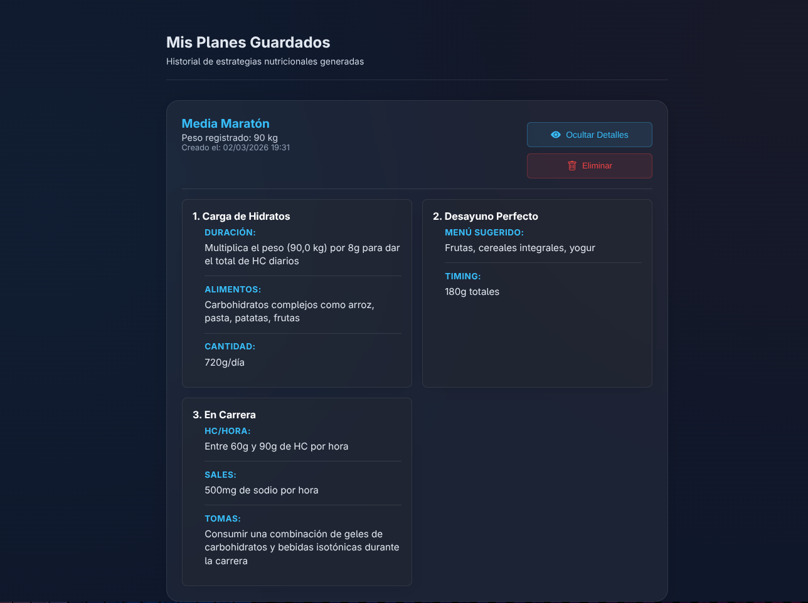

# 🏃 EnduranceCoach AI


**Proyecto Final de Máster (TFM) - Máster de Desarrollo con IA (BIGSEO)**
* **Alumno:** Juan Pablo Bermúdez Pulgarín
* **Email:** jberpu82@gmail.com

---

## 1. Descripción general del proyecto

**EnduranceCoach AI** es una plataforma web integral diseñada para revolucionar la gestión deportiva en disciplinas de resistencia (running, triatlón, ciclismo). Esta aplicación combina la potencia de un backend robusto en Java con la inteligencia de modelos generativos (OpenAI) para actuar como un preparador físico virtual. 

El objetivo principal de la aplicación es democratizar el acceso a entrenamientos de élite, generando de forma automática planes de entrenamiento y estrategias de nutrición hiper-personalizados basados en las métricas fisiológicas reales del atleta (FTP, VO2Max, Peso, Frecuencia Cardíaca). Todo ello presentado en una interfaz moderna, segura y orientada a la experiencia de usuario.

---

## 2. Stack tecnológico utilizado

El sistema sigue una arquitectura monolítica modular completamente desacoplada (Cliente-Servidor).

**Backend (Servidor & IA):**
* **Lenguaje:** Java 21
* **Framework Core:** Spring Boot 3.2.x
* **Inteligencia Artificial:** Spring AI integrado con la API de OpenAI (GPT).
* **Seguridad:** Spring Security con JSON Web Tokens (JWT).
* **Persistencia de Datos:** Spring Data JPA + Hibernate.
* **Base de Datos:** PostgreSQL (Relacional).

**Frontend (Cliente):**
* **Framework:** Angular 17+ (Arquitectura moderna basada en *Standalone Components*).
* **Estilos y UX/UI:** CSS3 nativo puro implementando diseño *Glassmorphism* (efectos de cristal, desenfoques y variables CSS).
* **Enrutamiento y Seguridad:** Angular Router protegido mediante AuthGuards.
* **Peticiones HTTP:** `HttpClient` nativo para consumo de API RESTful.

---

## 3. Información sobre su instalación y ejecución

Para desplegar el proyecto en un entorno local, asegúrate de tener instalados **Java 21**, **Node.js (v18+)** y **PostgreSQL**.

### 3.1 Configuración de la Base de Datos
1. Abre tu gestor de PostgreSQL y crea la base de datos:
   ```sql
   CREATE DATABASE endurancecoach;

```

2. Navega al archivo `/backend/src/main/resources/application.properties` y configura tus credenciales:
```properties
spring.datasource.url=jdbc:postgresql://localhost:5432/endurancecoach
spring.datasource.username=TU_USUARIO_POSTGRES
spring.datasource.password=TU_PASSWORD_POSTGRES

```


### 3.2 Configuración de Variables de Entorno (Tokens e IA)

En el mismo archivo `application.properties`, añade tus claves de seguridad:

```properties
jwt.secret=TU_SECRETO_SUPER_SEGURO_Y_LARGO_PARA_LOS_TOKENS_JWT
openai.api.key=sk-TU_API_KEY_DE_OPENAI

```

### 3.3 Ejecución del Servidor (Backend)

Abre una terminal en la carpeta `/backend` y ejecuta:

```bash
./mvnw clean spring-boot:run

```

*El servidor se iniciará en `http://localhost:8080` y creará las tablas automáticamente.*

### 3.4 Ejecución del Cliente (Frontend)

Abre una nueva terminal en la carpeta `/frontend`:

```bash
npm install
ng serve

```

*Accede a la aplicación desde tu navegador en `http://localhost:4200`.*

---

## 4. Estructura del proyecto

El código está organizado siguiendo los principios de Clean Code y separación de responsabilidades:

```text
EnduranceCoach/
│
├── backend/ (Spring Boot)
│   ├── src/main/java/com/tfm/backend/
│   │   ├── config/       # Configuración global (CORS, SecurityFilterChain)
│   │   ├── controller/   # Endpoints de la API RESTful
│   │   ├── dto/          # Objetos de Transferencia de Datos (Seguridad de payload)
│   │   ├── model/        # Entidades JPA (Mapeo a base de datos)
│   │   ├── repository/   # Interfaces de acceso a datos (PostgreSQL)
│   │   ├── security/     # Filtros JWT y autenticación
│   │   └── service/      # Lógica de negocio y Prompts de Inteligencia Artificial
│   └── src/main/resources/
│       └── application.properties # Variables de entorno
│
└── frontend/ (Angular 17)
    └── src/app/
        ├── guards/       # Protección de rutas (auth.guard.ts)
        ├── pages/        # Componentes Standalone (Vistas principales)
        │   ├── dashboard/   # Panel de control y estadísticas
        │   ├── login/       # Autenticación
        │   ├── metrics/     # Gestión de fisiología
        │   ├── nutrition/   # Generador IA de dietas
        │   ├── profile/     # Perfil del atleta
        │   └── training/    # Generador IA de entrenamientos
        └── services/     # Servicios HTTP y gestión del estado (Token)

```

---

## 5. Funcionalidades principales

1. **🔒 Sistema de Autenticación Seguro:** Registro y login de usuarios con contraseñas encriptadas en base de datos. Las rutas del frontend y los endpoints del backend están protegidos mediante validación de Tokens JWT enviados por cabecera HTTP.
2. **🤖 Motor de IA para Entrenamiento (Core Feature):** A través de Spring AI y un detallado *Prompt Engineering*, la plataforma genera microciclos de entrenamiento adaptados a objetivos específicos (Ej: "Bajar de 3h en Maratón"). Considera carga, descanso y periodización.
3. **🍏 Estrategia Nutricional Inteligente:** Generación de pautas nutricionales dinámicas. La IA evalúa el peso del atleta y sus objetivos de resistencia para estructurar ingestas de carbohidratos, hidratación y estrategias para el día de la carrera.
4. **📊 Gestión de Métricas Fisiológicas:** Panel de control (Dashboard) dinámico y sistema de perfiles que permite al atleta registrar y actualizar sus zonas de trabajo (FTP, Frecuencia Cardíaca Máxima y en Reposo). Estos datos alimentan el contexto de la IA para hacer los planes hiper-personalizados.
5. **📈 Dashboard y Analítica:** Cálculo y renderizado en tiempo real de estadísticas de uso: racha de entrenamientos activos, total de planes generados y un resumen de las actividades más recientes extraídas de la base de datos relacional.

---

---

## 📸 Capturas de Pantalla de la Aplicación

### 🔒 Acceso y Seguridad


### 📊 Panel de Control (Dashboard)


### 👤 Perfil del Usuario


### 🏃 Generador de Entrenamientos (IA)



### 🍏 Estrategia Nutricional Inteligente (IA)

